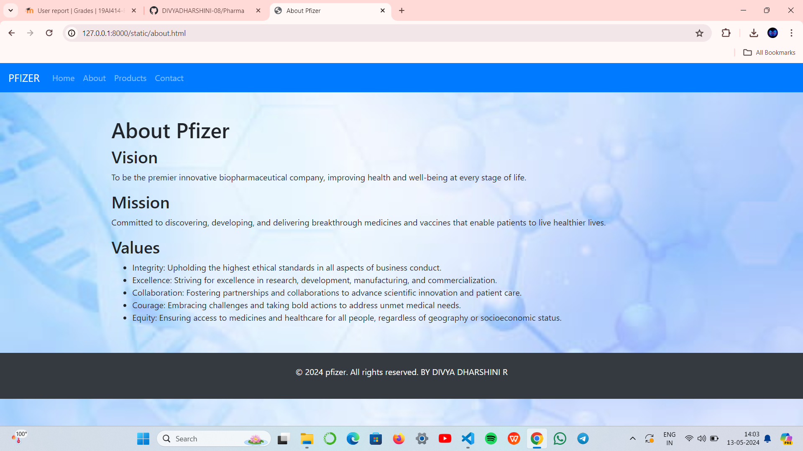

# Project Responsive Web Design using Bootstrap
## Date:13-05-2024

## AIM:
To design a responsive website for a Pharmaceutical Company using Bootstrap.


## DESIGN STEPS:

### Step 1:
Clone the repository from GitHub.

### Step 2:
Create Django Admin project.

### Step 3:
Create a New App under the Django Admin project.

### Step 4:
Insert the necessary CSS and JavaScript files as external in order to use Bootstrap.

### Step 5:
Create a HTML file and include the needed Bootstrap components.

### Step 6:
Publish the website in the LocalHost.

## PROGRAM :

```
web.html

<!DOCTYPE html>
<html lang="en">
<head>
  <meta charset="UTF-8">
  <meta name="viewport" content="width=device-width, initial-scale=1.0">
  <title>Home - PFIZER</title>
  <!-- Bootstrap CSS -->
  <link href="https://stackpath.bootstrapcdn.com/bootstrap/4.5.2/css/bootstrap.min.css" rel="stylesheet">
</head>
<body>

  <!-- Navbar -->
  <nav class="navbar navbar-expand-lg navbar-dark bg-primary">
    <a class="navbar-brand" href="#">PFIZER</a>
    <button class="navbar-toggler" type="button" data-toggle="collapse" data-target="#navbarSupportedContent" aria-controls="navbarSupportedContent" aria-expanded="false" aria-label="Toggle navigation">
      <span class="navbar-toggler-icon"></span>
    </button>

    <div class="collapse navbar-collapse" id="navbarSupportedContent">
      <ul class="navbar-nav mr-auto">
        <li class="nav-item active">
          <a class="nav-link" href="web.html">Home <span class="sr-only">(current)</span></a>
        </li>
        <li class="nav-item">
          <a class="nav-link" href="about.html">About</a>
        </li>
        <li class="nav-item">
          <a class="nav-link" href="product.html">Products</a>
        </li>
        <li class="nav-item">
          <a class="nav-link" href="contact.html">Contact</a>
        </li>
      </ul>
      <ul class="navbar-nav ml-auto">
        <li class="nav-item">
          <a class="nav-link" href="#">Login</a>
        </li>
        <li class="nav-item">
          <a class="nav-link" href="#">Register</a>
        </li>
      </ul>
    </div>
  </nav>

  <!-- Page Content -->
  <div class="container mt-5">
    <div class="row">
      <div class="col-md-8">
        <h1>Welcome to Pfizer</h1>
        <p>Welcome to PFIZER Company,Pfizer is a leading pharmaceutical company with a rich history of pioneering healthcare solutions for over a century. .</p>
        <p>Its global presence and dedication to research and development have earned it a reputation for innovation and reliability in delivering life-saving medications</p>
        <p>Pfizer's steadfast commitment to scientific excellence and its diverse portfolio of top-tier products make it a trusted choice for those seeking cutting-edge medical solutions and reliable healthcare. </p>
        <p>Thank you for choosing Pfixer for your healthcare needs. We look forward to serving you and helping you live a healthier life.</p>
      </div>
      <div class="col-md-4">
        
      </div>
    </div>
  </div>
  <body background="1.jpeg" style="background-repeat: no-repeat; background-size: cover;">
  <br>
  <br>
  <br>
  <br>

  <!-- Footer -->
  <footer class="bg-dark text-white text-center py-4 mt-5">
    <p>&copy; 2024 Pfixer. All rights reserved. BY DIVYA DHARSHINI R</p>
  </footer>

  <!-- Bootstrap JS -->
  <script src="https://code.jquery.com/jquery-3.5.1.slim.min.js"></script>
  <script src="https://cdn.jsdelivr.net/npm/popper.js@1.16.1/dist/umd/popper.min.js"></script>
  <script src="https://stackpath.bootstrapcdn.com/bootstrap/4.5.2/js/bootstrap.min.js"></script>
</body>
</html>

```
```
about.html

<!DOCTYPE html>
<html lang="en">
<head>
  <meta charset="UTF-8">
  <meta name="viewport" content="width=device-width, initial-scale=1.0">
  <title>About Pfizer</title>
  <!-- Bootstrap CSS -->
  <link href="https://stackpath.bootstrapcdn.com/bootstrap/4.5.2/css/bootstrap.min.css" rel="stylesheet">
</head>
<body>

  <!-- Navbar -->
  <nav class="navbar navbar-expand-lg navbar-dark bg-primary">
    <a class="navbar-brand" href="#">PFIZER</a>
    <button class="navbar-toggler" type="button" data-toggle="collapse" data-target="#navbarSupportedContent" aria-controls="navbarSupportedContent" aria-expanded="false" aria-label="Toggle navigation">
      <span class="navbar-toggler-icon"></span>
    </button>

    <div class="collapse navbar-collapse" id="navbarSupportedContent">
      <ul class="navbar-nav mr-auto">
        <li class="nav-item">
          <a class="nav-link" href="web.html">Home</a>
        </li>
        <li class="nav-item">
          <a class="nav-link" href="about.html">About</a>
        </li>
        <li class="nav-item">
          <a class="nav-link" href="product.html">Products</a>
        </li>
        <li class="nav-item">
          <a class="nav-link" href="#">Contact</a>
        </li>
      </ul>
    </div>
  </nav>

  <!-- Page Content -->
  <div class="container mt-5">
    <div class="row">
      <div class="col-md-12">
        <h1>About Pfizer</h1>
        <div id="vision">
          <h2>Vision</h2>
          <p>To be the premier innovative biopharmaceutical company, improving health and well-being at every stage of life.</p>
        </div>
        <div id="mission">
          <h2>Mission</h2>
          <p>Committed to discovering, developing, and delivering breakthrough medicines and vaccines that enable patients to live healthier lives.</p>
        </div>
        <div id="values">
          <h2>Values</h2>
          <ul>
            <li>Integrity: Upholding the highest ethical standards in all aspects of business conduct.</li>
            <li>Excellence: Striving for excellence in research, development, manufacturing, and commercialization.</li>
            <li>Collaboration: Fostering partnerships and collaborations to advance scientific innovation and patient care.</li>
            <li>Courage: Embracing challenges and taking bold actions to address unmet medical needs.</li>
            <li>Equity: Ensuring access to medicines and healthcare for all people, regardless of geography or socioeconomic status.</li>
      
          </ul>
        </div>
        <br>
        <!-- Add more subheadings as needed -->
      </div>
    </div>
  </div>
  <body background="2.jpg" style="background-repeat: no-repeat; background-size: cover;"></body>
  <!-- Footer -->
  <footer class="bg-dark text-white text-center py-4 mt-3">
    <p>&copy; 2024 pfizer. All rights reserved.  BY DIVYA DHARSHINI R</p>
  </footer>

  <!-- Bootstrap JS -->
  <script src="https://code.jquery.com/jquery-3.5.1.slim.min.js"></script>
  <script src="https://cdn.jsdelivr.net/npm/popper.js@1.16.1/dist/umd/popper.min.js"></script>
  <script src="https://stackpath.bootstrapcdn.com/bootstrap/4.5.2/js/bootstrap.min.js"></script>
</body>
</html>

```
```
product.html

<!DOCTYPE html>
<html lang="en">
<head>
  <meta charset="UTF-8">
  <meta name="viewport" content="width=device-width, initial-scale=1.0">
  <title>Products - Pfizer</title>
  <!-- Bootstrap CSS -->
  <link href="https://stackpath.bootstrapcdn.com/bootstrap/4.5.2/css/bootstrap.min.css" rel="stylesheet">
</head>
<body>

  <!-- Navbar -->
  <nav class="navbar navbar-expand-lg navbar-dark bg-primary">
    <a class="navbar-brand" href="#">Pfizer</a>
    <button class="navbar-toggler" type="button" data-toggle="collapse" data-target="#navbarSupportedContent" aria-controls="navbarSupportedContent" aria-expanded="false" aria-label="Toggle navigation">
      <span class="navbar-toggler-icon"></span>
    </button>
    <div class="collapse navbar-collapse" id="navbarSupportedContent">
      <ul class="navbar-nav mr-auto">
        <li class="nav-item">
          <a class="nav-link" href="web.html">Home</a>
        </li>
        <li class="nav-item">
          <a class="nav-link" href="about.html">About</a>
        </li>
        <li class="nav-item dropdown">
          <a class="nav-link dropdown-toggle" href="#" id="navbarDropdown" role="button" data-toggle="dropdown" aria-haspopup="true" aria-expanded="false">
            Products
          </a>
          <div class="dropdown-menu" aria-labelledby="navbarDropdown">
            <a class="dropdown-item" href="#">Prevnar 13 (Pneumococcal 13-valent Conjugate Vaccine)</a>
            <a class="dropdown-item" href="#">Eliquis (Apixaban)</a>
            <a class="dropdown-item" href="#">Lyrica (Pregabalin)</a>
            <a class="dropdown-item" href="#">Viagra (Sildenafil)</a>
          </div>
        </li>
        <li class="nav-item active">
          <a class="nav-link" href="contact.html">Contact</a>
        </li>
      </ul>
      <ul class="navbar-nav ml-auto">
        <li class="nav-item">
          <a class="nav-link" href="#">Login</a>
        </li>
        <li class="nav-item">
          <a class="nav-link" href="#">Register</a>
        </li>
      </ul>
    </div>
  </nav>

  <!-- Page Content -->
  <div class="container mt-3">
    <div class="row">
      <div class="col-md-12">
        <h1>Our Product categories</h1>
        <div class="card-deck">
          <div class="card">
            
            <div class="card-body">
              <h5 class="card-title">revnar 13 (Pneumococcal 13-valent Conjugate Vaccine)</h5>
              <p class="card-text">Leading pneumococcal vaccine protecting against 13 strains of Streptococcus pneumoniae.
                Used for the prevention of pneumonia, meningitis, and other pneumococcal diseases.</p>
              <a href="#" class="btn btn-primary">Buy Now</a>
            </div>
          </div>
          <div class="card">
            
            <div class="card-body">
              <h5 class="card-title">Eliquis (Apixaban)</h5>
              <p class="card-text">Oral anticoagulant used for reducing the risk of stroke and systemic embolism in patients with nonvalvular atrial fibrillation.
                Also prescribed for the treatment and prevention of deep vein thrombosis and pulmonary embolism.</p>
              <a href="#" class="btn btn-primary">Buy Now</a>
            </div>
          </div>
          <div class="card">
            
            <div class="card-body">
              <h5 class="card-title">Lyrica (Pregabalin)</h5>
              <p class="card-text">Medication used to treat neuropathic pain, fibromyalgia, epilepsy, and generalized anxiety disorder.
                Acts on the central nervous system to reduce pain signals and control seizures.</p>
              <a href="#" class="btn btn-primary">Buy Now</a>
            </div>
          </div>
          <div class="card">
            
            <div class="card-body">
              <h5 class="card-title">Viagra (Sildenafil)</h5>
              <p class="card-text">Well-known medication for the treatment of erectile dysfunction (ED).
                Works by increasing blood flow to the penis, allowing for sustained erections during sexual arousal.
              </p>
              <a href="#" class="btn btn-primary">Buy Now</a>
            </div>
          </div>
        </div>
      </div>
    </div>
  </div>

  <!-- Footer -->
  <footer class="bg-dark text-white text-center py-4 mt-5">
    <p>&copy; 2024 Pfizer. All rights reserved. DIVYA DHARSHIN R</p>
  </footer>
  <body background="3.jpg" style="background-repeat: no-repeat; background-size: cover;">


  <!-- Bootstrap JS -->
  <script src="https://code.jquery.com/jquery-3.5.1.slim.min.js"></script>
  <script src="https://cdn.jsdelivr.net/npm/popper.js@1.16.1/dist/umd/popper.min.js"></script>
  <script src="https://stackpath.bootstrapcdn.com/bootstrap/4.5.2/js/bootstrap.min.js"></script>
</body>
</html>

```
```
contact.html

<!DOCTYPE html>
<html lang="en">
<head>
  <meta charset="UTF-8">
  <meta name="viewport" content="width=device-width, initial-scale=1.0">
  <title>Contact Us - Pfizer</title>
  <!-- Bootstrap CSS -->
  <link href="https://stackpath.bootstrapcdn.com/bootstrap/4.5.2/css/bootstrap.min.css" rel="stylesheet">
</head>
<body>

  <!-- Navbar -->
  <nav class="navbar navbar-expand-lg navbar-dark bg-primary">
    <a class="navbar-brand" href="#">PFIZER</a>
    <button class="navbar-toggler" type="button" data-toggle="collapse" data-target="#navbarSupportedContent" aria-controls="navbarSupportedContent" aria-expanded="false" aria-label="Toggle navigation">
      <span class="navbar-toggler-icon"></span>
    </button>

    <div class="collapse navbar-collapse" id="navbarSupportedContent">
      <ul class="navbar-nav mr-auto">
        <li class="nav-item">
          <a class="nav-link" href="web.html">Home</a>
        </li>
        <li class="nav-item">
          <a class="nav-link" href="about.html">About</a>
        </li>
        <li class="nav-item">
          <a class="nav-link" href="product.html">Products</a>
        </li>
        <li class="nav-item active">
          <a class="nav-link" href="contact.html">Contact <span class="sr-only">(current)</span></a>
        </li>
      </ul>
    </div>
  </nav>

  <!-- Page Content -->
  <div class="container mt-5">
    <div class="row">
      <div class="col-md-8">
        <h1>Contact Us</h1>
        <p>For any inquiries or feedback, please fill out the form below and we will get back to you as soon as possible.</p>
        <form>
          <div class="form-group">
            <label for="name">Your Name</label>
            <input type="text" class="form-control" id="name" placeholder="Enter your name">
          </div>
          <div class="form-group">
            <label for="email">Your Email</label>
            <input type="email" class="form-control" id="email" placeholder="Enter your email">
          </div>
          <div class="form-group">
            <label for="message">Message</label>
            <textarea class="form-control" id="message" rows=3" placeholder="Enter your message"></textarea>
          </div>
          <button type="submit" class="btn btn-primary">Submit</button>
        </form>
      </div>
      <div class="col-md-4">
        <h2>Pfizer</h2>
        <address>
          <strong>Address:</strong><br>
          Pfizer Street<br>
          India, 9895<br><br>
          <strong>Email:</strong><br>
          divi@pfizer.com<br><br>
          <strong>Phone:</strong><br>
          +91 8610438038
        </address>
      </div>
    </div>
  </div>
 
  <body background="4.jpg" style="background-repeat: no-repeat; background-size: cover;">

    <br>
    <br>
  <!-- Footer -->
  <footer class="bg-dark text-white text-center py-4 mt-2 ">
    <p>&copy; 2024 Pfizer. All rights reserved.BY DIVYA DHARSHINI R</p>

  </footer>

  <!-- Bootstrap JS -->
  <script src="https://code.jquery.com/jquery-3.5.1.slim.min.js"></script>
  <script src="https://cdn.jsdelivr.net/npm/popper.js@1.16.1/dist/umd/popper.min.js"></script>
  <script src="https://stackpath.bootstrapcdn.com/bootstrap/4.5.2/js/bootstrap.min.js"></script>
</body>
</html>

```

## OUTPUT:




## RESULT:
The Project for responsive web design using Bootstrap is completed successfully.
